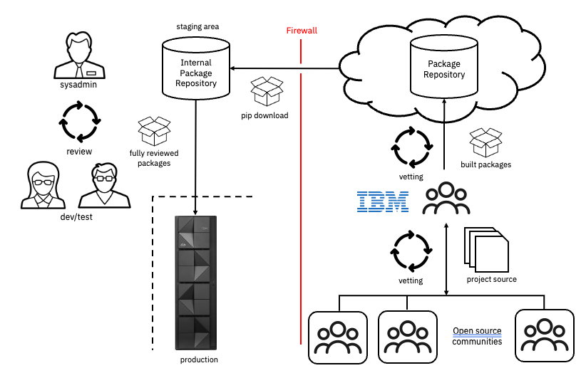
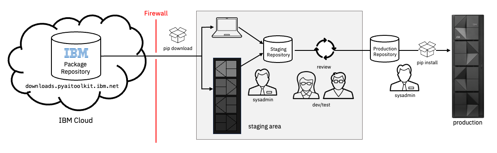

# Best Practices for Toolkit Deployment
Other sections of this document describe the mechanisms of the Python ecosystem, and the 
steps taken by the Toolkit development team to enable secure Python workload deployments. 
This section describes the active steps that administrators and users need to take their 
environments fully secure.

Many parts of these best practices are likely already part of your production environment 
on z/OS.  They are listed here to provide a complete picture of a secure deployment.  The
goal is to leverage the capabilities of the Python ecosystem from the familiar best 
practices that have emerged on the z/OS platform over decades of practice.

## A Word About Air-gapped Systems
Isolation from the outside world is a common practice and essential security measure for 
z/OS production environments.  Although the pip package manager has not been used to deploy 
Python products on z/OS before, it has been central to the Python ecosystem for over 20
years, and it accommodates air-gapped deployments.

A key piece of the isolation architecture is to assemble products into an internal staging 
area for review before use in a production environment.  The steps outlined below show how 
to assemble Python packages through pip into a staging area.  From there, most of the 
common isolation practices familiar to z/OS administrators apply.

  
_**figure 1.  Isolation architecture**_.

## The Package Channel
In addition to the vetting measures described in the 
[Python and Supply Chain Security](./python_supply_security.md) section, the Toolkit uses 
a secure server to provide built packages for pip download and install requests.  This server 
is located in the IBM cloud and is managed solely by an IBM team.  There are no contributions 
allowed from 3rd parties to this channel.  This eliminates a primary attack vector that 
threat actors often exploit.

The Toolkit product is orderable from IBM Shopz for no cost, and when installed, the 
contents primarily consist of a README file describing how to install the content of the 
toolkit using the secure package channel.  This channel consists of 3 key parts:
- A web interface that indexes all of the packages available for download/install, similar
to the pypi.org community index.
    - [https://ibm-z-oss-oda.github.io/python_ai_toolkit_zos/](https://ibm-z-oss-oda.github.io/python_ai_toolkit_zos/)
- The secure package server.  This is the package provider for the pip command.
    - ```downloads.pyaitoolkit.ibm.net```
- The Toolkit github repository.  This provides requirements files for downloading, 
assorted documentation, news and announcements, and a discussion group for questions.
    - [https://github.com/ibm-z-oss-oda/python_ai_toolkit_zos](https://github.com/ibm-z-oss-oda/python_ai_toolkit_zos)

The Toolkit can be installed as an entire product, or as a subset of packages.  This not only 
provides flexibility during initial install, it supports more agile service updates when 
resolving security exposures.  The package channel supports either approach to installation.

## The Toolkit Requirements File
Requirements files can be thought of as recipes for assembling sets of Python packages.  The 
Toolkit team provides a requirements file that enables the download or install of all packages
in the Toolkit at the latest available version.  Whenever updates are made to any of the 
packages in the Toolkit, this file is updated.

Here is a sample of a Python 3.11 Toolkit requirements file.

```
#####
#
# Python AI Toolkit for IBM z/OS
#
# This is the complete list of packages that make up the Python AI
# Toolkit for IBM z/OS.
#
# Example use:  pip install --no-deps -r <toolkit_requirements.txt>
#
# pip command options:
--index-url https://downloads.pyaitoolkit.ibm.net/repository/python_ai_toolkit_zos/simple
--trusted-host downloads.pyaitoolkit.ibm.net
--require-hashes
--only-binary :all:

#
# This requirements file was generated for a cp311 environment.
#

alembic==1.10.4 --hash=sha256:a9e9324d112fc51ecb3fa13605d70d72147e9e789cd55605562a9c9ff80852ca
aniso8601==9.0.1 --hash=sha256:cf9e7fa3cf8f85ed2e99e1aaddff98c27a37c7b3d90c77074aa7415123f66c5a
argon2-cffi-bindings==21.2.0.post0 --hash=sha256:9252cc8af1040a0348a69a7781d6b237496446a5f57c9494b65d2dc74c46f786
. . .
```  
_**example 1. The Toolkit requirements file**_.

There are 2 sections:
- The pip command line options.  This contains several key arguments so that you don't have to 
specify them when running the pip command.  These options tell pip to use the IBM package server, 
and download only those packages with 
hashes in the package list below.  These are key security measures.
- The list of packages to download or install along with their version numbers, and hashes.

Installation of the Toolkit using this requirements file is as simple as running the pip command.

### The IBM Package Server
The IBM package server is located at ```downloads.pyaitoolkit.ibm.net```.  This destination has to 
be available through the firewall.  Note that this doesn't have to be exposed to your production 
machine, but rather to any machine inside your corporate firewall.

Python packages have a very structured naming format that is used by pip to determine which instance
of a package to return for a download or install request.  This is outlined in the 
[Python Packaging User Guide](https://packaging.python.org/en/latest/specifications/binary-distribution-format/#file-format).
One component of this name is the python version number, which is required for packages that contain
compiled code specific to a Python version.  Some of the packages in the Toolkit require that this
version number be specified when downloading or installing.  

Here is an example showing how to download the full Toolkit using the official requirements file 
from the [Python AI Toolkit Github repository](https://github.com/ibm-z-oss-oda/python_ai_toolkit_zos/tree/main/requirements).

```
/tmp/wheels> pip download --no-deps --python-version 3.11 -r requirements.txt
adding trusted host: 'downloads.pyaitoolkit.ibm.net' (from line 12 of requirements.txt)
Looking in indexes: https://downloads.pyaitoolkit.ibm.net/repository/python_ai_toolkit_zos/simple
Collecting alembic==1.10.4 (from -r requirements.txt (line 20))
  Downloading https://downloads.pyaitoolkit.ibm.net/repository/python_ai_toolkit_zos/packages/alembic/1.10.4/alembic-1.10.4-py3-none-any.whl (251 kB)
     ━━━━━━━━━━━━━━━━━━━━━━━━━━━━━━━━━━━━━━━━ 251.1/251.1 kB 536.1 kB/s eta 0:00:00
Collecting aniso8601==9.0.1 (from -r requirements.txt (line 21))
  Downloading https://downloads.pyaitoolkit.ibm.net/repository/python_ai_toolkit_zos/packages/aniso8601/9.0.1/aniso8601-9.0.1-py2.py3-none-any.whl (52 kB)
     ━━━━━━━━━━━━━━━━━━━━━━━━━━━━━━━━━━━━━━━━ 52.8/52.8 kB 701.6 kB/s eta 0:00:00
. . .
```
_**example 2.  Downloading the Toolkit from the IBM pypi server.**_.

This example was run from a laptop, although it would have worked just as well to run the pip 
command from a z/OS machine.  It resulted in a wheel file being pulled from the server
for every package in the Toolkit.  It demonstrates that since all of the packages from the 
Toolkit have been fully built as wheels (rather than source distributions), it's much simpler to
download them as atomic artifacts that can be deployed and managed from any platform.  The only
requirement is that there is a path from the package management machine of the staging area to 
the production environment for eventual deployment.

## The Staging Pipeline
A common best practice employed by many/most enterprises is to assemble workloads in a staging 
area.  This allows for integration testing and final verification before deployment to a production 
environment.

Although the development and test team at IBM employs several steps to 
[scan and validate](./python_supply_security.md) the set of packages of the Toolkit before 
releasing to the package repository for download, it's strongly suggested that individual 
enterprises apply their own review process to vet the code assembled in the staging repository.


_**figure 2.  The staging pipeline.**_.

Every organization will have their own standard for security vetting, and different scanning
toolchains will often give somewhat different results.  The review process indicated in the 
staging area of figure 2 above should include your organization's security assessment workflow.

System administrators play a key role in the staging pipeline.  They populate the staging 
repository with candidate packages from the IBM package repository, and assemble reviewed
packages into production environments.  Developers and data scientists who are familiar with
the Python ecosystem perform the necessary review of the downloaded package set.  

### The Staging Repository
A strength of the Python packaging mechanism is the flexibility of the infrastructure that
it can leverage.  Any platform supporting the pip command line can download packages from the 
IBM package repository.  These packages can be stored in a filesystem, or on a remote server. 
This enables several different types of staging repository configuration:

- A Unix System Services filesystem on z/OS.  Any filesystem with 2 GB or more of free space
can be used to store the wheels of the Toolkit.   Pip requests using the ```no-index``` and 
```find-links``` options from can pull packages from a zFS filesystem on z/OS serving as the
local package repository.  See 
[pip install options](https://pip.pypa.io/en/stable/cli/pip_install/#options)
documentation for details.
- A pypi repository served from an artifact server like Sonatype Nexus or JFrog Artifactory. 
These kinds of servers can be hosted in several different ways:
    - Locally on z/OS in a zCX container.
    - From a Linux partition on IBM Z or LinuxONE.  These can either be from a container 
    configuration, or installed directly on the system image.
    - As-a-service from a cloud.  The most secure configurations will be local clouds within
    the organization's firewalled perimeter.  These kinds of deployments can be servers that
    provide packages to all platforms within the enterprise.

## Final Thoughts
Deploying Python packages to users through pip command line requests is a simple idea.  Doing 
so securely is complex.  There are a lot of details to consider that vary from one enterprise 
to another.  A key idea is to first acquire the content of the Toolkit from the secure IBM 
package repository, and locate that content within your enterprise.  Once inside your firewall, 
use conventional best practices for managing and reviewing software for production purposes. 
This will provide you with a far more secure environment than working with a default community 
package server.
