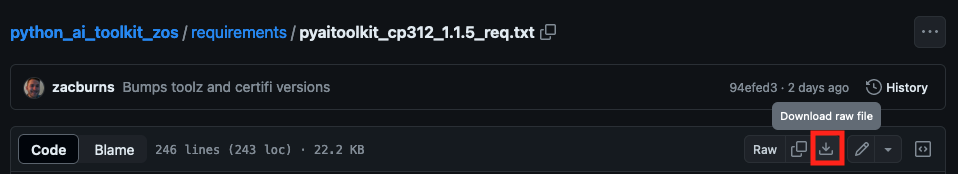

# Downloading the Python AI Toolkit Manually
The set of packages that make up the Python AI Toolkit may be downloaded manually using 
the the pip package manager (pip) from the Toolkit's package server 
(downloads.pyaitoolkit.ibm.net) to any internet-connected system with Python and pip 
installed.  The examples shown here were all run from an Apple Macbook, but these tasks 
could have run just as easily from a Windows laptop, linux image in the cloud, or 
from a z/OS LPAR.

All Toolkit packages are pip wheels, meaning that each has been fully built and 
saved in an archive file with a file type of ```.whl```.  These wheels are what you 
will download and install on a target z/OS system.

The Toolkit supports all Python versions provided by the Open Enterprise SDK for Python.
For each of these Python versions, the Toolkit includes a manifest called a 
_requirements file_ that enables the download and install of all these wheels.  Once the 
wheels have been downloaded, they're transferred to the target z/OS system and
installed.  Details of how to do this are in the examples below.  

## Acquire the Packages
Make sure Python is installed on your internet-connected system.  We'll refer to this machine as
_**dist**_.  

 ```
 dist> python3 --version  
 Python 3.12.3
 ```

If you don't have Python installed, please see 
[https://www.python.org/downloads/](https://www.python.org/downloads/) 
for details about how to install on your platform of choice.  This can be any machine 
inside your firewall, with access to the internet, and a direct or indirect path to the 
target z/OS system.  

Acquire the settings to reach the Toolkit package server, and the manifest of packages to 
download.  These are all contained in one file referred to as a _**requirements file**_.
Choose the version specific to the Python release you're using on the target z/OS 
system.  The Python version of your download system (dist) is not relevant, and doesn't have 
to match the target z/OS machine.

Download this file from 
[https://github.com/ibm-z-oss-oda/python_ai_toolkit_zos/tree/main/requirements](https://github.com/ibm-z-oss-oda/python_ai_toolkit_zos/tree/main/requirements). 

 

_Figure 1.  Downloading the requirements file for the Toolkit_

In this case, the target z/OS system will have Python 3.12 installed.  If you take 
a look at this requirements file, you can see the server settings and the package list. 

```
#####
#
# Python AI Toolkit for IBM z/OS
#
# This is the complete list of packages that make up the Python AI
# Toolkit for IBM z/OS.
#
# Example use:  pip install --no-deps -r <toolkit_requirements.txt>
#
# pip command options:
--index-url https://downloads.pyaitoolkit.ibm.net/repository/python_ai_toolkit_zos/simple
--trusted-host downloads.pyaitoolkit.ibm.net
--require-hashes
--only-binary :all:

#
# This requirements file was generated for a cp312 environment.
#

alembic==1.10.4 --hash=sha256:a9e9324d112fc51ecb3fa13605d70d72147e9e789cd55605562a9c9ff80852ca
aniso8601==9.0.1 --hash=sha256:cf9e7fa3cf8f85ed2e99e1aaddff98c27a37c7b3d90c77074aa7415123f66c5a
ansi2html==1.8.0 --hash=sha256:4c65d136b4638a95f914145eb758b150e953ee37cde2a587588bf53b096b90f0
. . .
```
_Figure 2.  An example requirements file_

The ```index-url``` and ```trusted-host``` options tell pip where the Toolkit server is, while 
the  ```require-hashes``` and ```only-binary``` options ensure that you're getting the exact 
package versions that should be on the server.  All packages that come from the Toolkit server
must have hashes that match what's listed in this requirements file to guard against
main-in-the-middle attacks.  Pip performs these checks during the download.

Now download all the files in the Toolkit.

```
dist> pip3 download --no-deps -r pyaitoolkit_cp312_1.1.5_req.txt
adding trusted host: 'downloads.pyaitoolkit.ibm.net' (from line 13 of pyaitoolkit_cp312_1.1.5_req.txt)
Looking in indexes: https://downloads.pyaitoolkit.ibm.net/repository/python_ai_toolkit_zos/simple
Collecting alembic==1.10.4 (from -r pyaitoolkit_cp312_1.1.5_req.txt (line 21))
    Downloading https://downloads.pyaitoolkit.ibm.net/repository/python_ai_toolkit_zos/packages/alembic/1.10.4/alembic-1.10.4-py3-none-any.whl (251 kB)
    ━━━━━━━━━━━━━━━━━━━━━━━━━━━━━━━━━━━━━━━━ 251.1/251.1 kB 4.7 MB/s eta 0:00:00
Collecting aniso8601==9.0.1 (from -r pyaitoolkit_cp312_1.1.5_req.txt (line 22))
    Downloading https://downloads.pyaitoolkit.ibm.net/repository/python_ai_toolkit_zos/packages/aniso8601/9.0.1/aniso8601-9.0.1-py2.py3-none-any.whl (52 kB)
. . .
```
_Figure 3.  Downloading the Toolkit_

The download for the full set of packages takes 2-3 minutes, and requires about 380 MB of disk 
space.  You should now have more than 230 installable packages with a file type of ```.whl```.

```
dist> ls *.whl
Babel-2.14.0-py3-none-any.whl				glib-2.56.4.post0-py3-none-any.whl			partd-1.2.0-py3-none-any.whl
Cython-3.0.9-cp312-none-any.whl				graphviz-0.20.1-py3-none-any.whl			patsy-0.5.3-py2.py3-none-any.whl
Flask-2.2.5.post0-py3-none-any.whl			gunicorn-21.2.0.post2-py3-none-any.whl		pexpect-4.8.0-py2.py3-none-any.whl
Flask_Cors-4.0.0-py2.py3-none-any.whl		h11-0.14.0-py3-none-any.whl				    pickleshare-0.7.5-py2.py3-none-any.whl
. . .
```
_Figure 4.  The downloaded wheels_

This is the set of packages that you will install on the target z/OS system.

## Bundling and Transferring the Toolkit
This step is optional, but it's a good idea to collect the requirements file and all 
these wheels into an archive for easier transfer to the target system, and for future 
reference.  Keeping all these parts together makes simplifies the task of managing them 
over time.

Collect the requirements file and all the wheels into a pax archive and include the 
date/time in the name so you know when these parts were pulled from the Toolkit 
package server.

```
dist> mkdir wheels
dist> mv *.whl wheels
dist> ls -l 
total 48
-rw-r--r--@   1 gandalf  staff  22690 Jun 26 14:25 pyaitoolkit_cp312_1.1.5_req.txt
drwxr-xr-x  228 gandalf  staff   7296 Jun 26 16:17 wheels
dist> pax -wvf pyaitoolkit_06262024.pax ./*
._pyaitoolkit_cp312_1.1.5_req.txt
./pyaitoolkit_cp312_1.1.5_req.txt
./wheels
./wheels/mistune-2.0.4-py2.py3-none-any.whl
./wheels/idna-3.4-py3-none-any.whl
. . .
```
_Figure 5.  Bundling everything together_

This example creates a pax archive of about 380 MB.  Since the wheel files are compressed 
archives, you don't save any real space by compressing the pax file with the ```-z``` 
option on the pax command.  Avoiding this option makes unpacking the archive on z/OS 
simpler.

Transfer the pax file from this machine to the target z/OS system where the Toolkit will be
installed.  This all depends on the network configuration and security measures of your 
company.

Be sure to have enough filesystem space for the pax file, the wheel files from the 
expanded pax, and the installed Toolkit.  All of these together should fit within a 2GB z/OS Unix 
filesystem.

On the target z/OS system, expand the pax file to gain access to all of the Toolkit 
package wheels.  We'll refer to this system as _**zos**_.

```
zos> pax -rvf pyaitoolkit_06262024.pax 
._pyaitoolkit_cp312_1.1.5_req.txt
./pyaitoolkit_cp312_1.1.5_req.txt
./wheels
./wheels/mistune-2.0.4-py2.py3-none-any.whl
./wheels/idna-3.4-py3-none-any.whl
. . .
```
_Figure 6.  Unpacking the Toolkit files_

The Python environment on z/OS works with ASCI text files by default.  This makes inter-operation
between z/OS and other platforms easier.  Since the requirements file from the pax file is a text 
file, it will be in ASCII form.  However, you need to give it a file tag so z/OS knows how to treat
it. 

```
zos> chtag -tc ISO8859-1 pyaitoolkit_cp312_1.1.5_req.txt
zos> ls -alT
total 739040
                    drwxr-xr-x   3 BOSTIAN  SYS1        8192 Jun 26 21:59 .
                    drwxr-xr-x   7 BOSTIAN  SYS1        8192 Jun 26 21:24 ..
- untagged    T=off -rw-------   1 BOSTIAN  SYS1         896 Jun 26 14:25 ._pyaitoolkit_cp312_1.1.5_req.txt
- untagged    T=off -rw-r--r--   1 BOSTIAN  SYS1     378132480 Jun 26 21:58 pyaitoolkit_06262024.pax
t ISO8859-1   T=on  -rw-r--r--   1 BOSTIAN  SYS1       22690 Jun 26 14:25 pyaitoolkit_cp312_1.1.5_req.txt
                    drwxr-xr-x   2 BOSTIAN  SYS1        8192 Jun 26 16:17 wheels
```
_Figure 7.  Tagging the requirements file as ASCII text_

Now you can read the text of the requirement file, and use it to install the Toolkit.

## Perform the Installation
Since the Toolkit is a set of library routines rather than a component of the system, you have 
lot of flexibility when deciding where to put it.  The Python community created _**virtual environments**_ 
to make this easier.  If you're making the Toolkit available to a set of developers or data 
scientists, you have the option of simply placing the wheel files at a common location so that 
these users can build their own virtual environments within the corporate firewall.

If you are unfamiliar with virtual environments and Python installations for z/OS, 
[this explanation](./packages_venvs.md) may be useful.  More information from the Python 
community's documentation on [Virtual Environments and Packages](https://docs.python.org/3/tutorial/venv.html)
may also be helpful.

Once you decide where to locate the Toolkit, you can install it like this:

```
zos/toolkit> ls 
pyaitoolkit_06262024.pax         pyaitoolkit_cp312_1.1.5_req.txt  wheels
zos/toolkit> python3 -m venv virt_env
zos/toolkit> source virt_env/bin/activate
(virt_env) zos/toolkit>pip list
Package Version
------- -------
pip     23.3.2
(virt_env) zos/toolkit> pip install -r pyaitoolkit_cp312_1.1.5_req.txt --no-index --no-deps -f file:////zos/toolkit/wheels
adding trusted host: 'downloads.pyaitoolkit.ibm.net' (from line 13 of pyaitoolkit_cp312_1.1.5_req.txt)
Looking in links: file://zos/wheels
Processing ./wheels/alembic-1.10.4-py3-none-any.whl (from -r pyaitoolkit_cp312_1.1.5_req.txt (line 21))
Processing ./wheels/aniso8601-9.0.1-py2.py3-none-any.whl (from -r pyaitoolkit_cp312_1.1.5_req.txt (line 22))
Processing ./wheels/ansi2html-1.8.0-py3-none-any.whl (from -r pyaitoolkit_cp312_1.1.5_req.txt (line 23))
. . .
Processing ./wheels/zict-2.2.0-py2.py3-none-any.whl (from -r pyaitoolkit_cp312_1.1.5_req.txt (line 244))
Processing ./wheels/zipp-3.11.0-py3-none-any.whl (from -r pyaitoolkit_cp312_1.1.5_req.txt (line 245))
Processing ./wheels/zos_util-1.0.1-cp312-none-any.whl (from -r pyaitoolkit_cp312_1.1.5_req.txt (line 246))
Installing collected packages: zos-util, Whoosh, webencodings, wcwidth, uWSGI, treelib, toree, tdqm, stack-data, sortedcontainers, 
sklearn-pandas, Send2Trash, retrying, requests-ftp, requests-file, pytz, pyftpdlib, pure-eval, ptyprocess, pretend, pickleshare, 
. . .
cloudpickle, click, chardet, cffi, certifi, cairocffi, cachetools, bleach, beautifulsoup4, bcrypt, Babel, attrs, async-lru, 
async-generator, arrow, argon2-cffi-bindings, argon2-cffi, anyio, ansi2html, alembic
Successfully installed Babel-2.14.0 Cython-3.0.9 Flask-2.2.5.post0 Flask-Cors-4.0.0 Flask-RESTful-0.3.9 HeapDict-1.0.1 JPype1-1.5.0 
JayDeBeApi-1.2.3 Jinja2-3.1.3 Mako-1.2.4 Markdown-3.4.1.post1 Markdown-Editor-1.0.7.post3 MarkupSafe-2.1.1 PyWavelets-1.3.0.post0 
PyYAML-6.0.1 Pygments-2.16.1 QtPy-2.1.0.post0 SQLAlchemy-2.0.29 Send2Trash-1.8.0 Werkzeug-3.0.1 Whoosh-2.7.4 XlsxWriter-3.1.2 
alembic-1.10.4 aniso8601-9.0.1 ansi2html-1.8.0
 . . .
tblib-1.7.0 tdqm-0.0.1 tenacity-8.2.3 terminado-0.15.0 threadpoolctl-3.1.0 tifffile-2023.4.12 tinycss2-1.1.1 toolz-0.12.1 
toree-0.5.0.post2 tornado-6.3.3 tqdm-4.64.1 traitlets-5.9.0 treelib-1.6.4 types-python-dateutil-2.9.0.20240316 typing-extensions-4.6.0 
uWSGI-2.0.21 uri-template-1.3.0 urllib3-1.26.18 virtualenv-20.25.3 wcwidth-0.2.6 webcolors-1.13 webencodings-0.5.1 
websocket-client-1.7.0 widgetsnbextension-4.0.7 zict-2.2.0 zipp-3.11.0 zos-util-1.0.1
(virt_env) zos/toolkit> 
(virt_env) zos/toolkit> pip list
Package                        Version
------------------------------ ---------------
alembic                        1.10.4
aniso8601                      9.0.1
ansi2html                      1.8.0
anyio                          4.3.0
...
```
_Figure 8.  Installing the Toolkit in a virtual environment_

There are several things that this example illustrates:
- A new virtual environment named ```virt_env``` is created.  
- This environment only has the pip package installed, as shown by the ```pip list``` command
- All the downloaded wheels are installed with the ```pip install``` command.  Key command arguments 
include:
    - ```-r``` use the specified requirements file.
    - ```--no-index``` ignore any package server (indexes) that have been configured, or specified 
    in the requirements file.
    - ```--no-deps``` do not perform any dependency checking during package installation. 
    - ```-f``` get all of the packages to install from a location in the local z/OS Unix file system.
    These are the downloaded wheel files. 
- Pip list shows the full list of installed packages.

The Python AI Toolkit for IBM z/OS is now installed into a virtual environment from a set of Python 
wheel files that have been manually downloaded from the Toolkit package server.  This environment 
can now be activated and used as the runtime environment for any AI applications to run natively 
on z/OS.