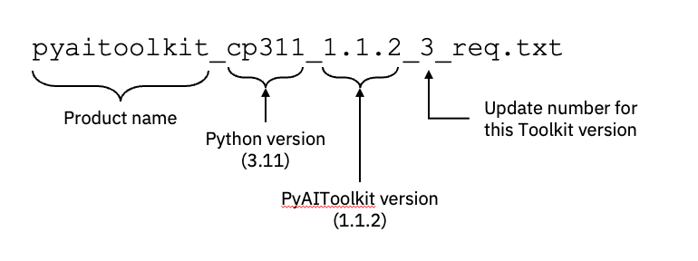

# Requirements Files
As outlined in [Deployment Best Practices](https://github.com/ibm-z-oss-oda/python_ai_toolkit_zos/blob/main/docs/deployment_best_practices.md#the-toolkit-requirements-file),
a requirements file is a self-contained recipe for downloading, installing, and updating 
sets of Python packages.  They are very flexible tools for collecting and managing full
and partial sets of of packages for a variety of different purposes.

We publish a requirements file for the toolkit that lists all the latest versions of 
all the packages available in the offering.  You can use this file to install the full
toolkit as a single product, or if you have previously installed the toolkit, you can use
the ```pip install --upgrade``` command to upgrade any packages you currently have to 
their latest versions.  This file gets updated whenever any updates are made to any 
individual package for the Toolkit.

## Requirements File Naming
The latest requirements file at the time of this writing is ```pyaitoolkit_cp311_1.1.2_3_req.txt```.
This name encodes a lot of information about the Toolkit version:



The Python version component of the requirements file name name indicates the version of the 
Python SDK this requirements file corresponds to.  The SDK is written mostly in C code, and 
has been built with a specific version of the C compiler and LE runtime library.  This 
environment can change from one release to the next, making each SDK release distinct from 
another.  For example, the Python 3.11 SDK has a specific set of runtime characteristics that 
may be different from the Python 3.12 version.

Most code in a Python package is "pure Python".  Since it's interpreted, it usually will run 
using any SDK version.  However, a significant percentage of code in many Python packages is 
compiled itself.  In these cases, it's necessary build and test those packages on a specific
Python version to ensure correctness.  As a result, we maintain a version of the Toolkit 
requirements file for every supported Python SDK release.  It's important to use the version
that matches your installed Python SDK.

The Python AI Toolkit version represents the release of the Toolkit product.  The first 
published release was 1.1.0, and has since been incremented twice.  Updates to the Toolkit
version number occur when significant additions of new content are made to the product.

The update number represents the number of currency upgrades that have been made to packages
in the Toolkit product between Toolkit version increments.  In this example, version 1.1.2
of the Toolkit has had one or more packages upgraded 3 times.  These upgrades are to 
packages that already existed in the Toolkit, and do not represent new package additions.

## Maintaining Toolkit Currency
When you download the Python AI Toolkit, we recommend that you use the requirements file
to establish a baseline that corresponds to a specific Toolkit release.  Save the requirements
file in your environment so that you can compare to newer toolkit requirements files as they
are published over time.  The name of the requirements allows you to understand if your 
current version is the latest available, and can inform your upgrade decisions.  Saving all
of the requirements files you obtain from 
[https://github.com/ibm-z-oss-oda/python_ai_toolkit_zos/tree/main/requirements](https://github.com/ibm-z-oss-oda/python_ai_toolkit_zos/tree/main/requirements
) can give you a complete history of your Toolkit upgrades over time.