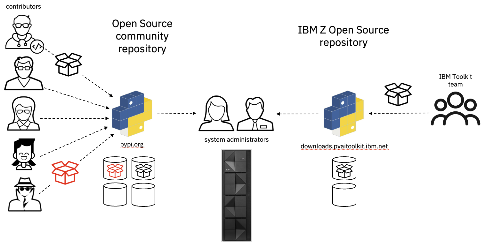

# Secure Toolkit Access
A key part of the Python Ecosystem is the Python package index, [pypi.org](https://pypi.org/).  This 
site provides both a directory of Python-based open source projects, and a repository that serves 
the  packages built for those projects.  Started in 2001, it is a community server that allows users 
to discover and share software, and is essential infrastructure to enhance the broad acceptance of 
Python as a language.  It has served as a model for other open languages and packaging mechanisms 
that have followed. 


_**figure 1.  Python package servers**_.

## The Pypi Community Server
A community server allows users to register, free of charge, and to list details of their project 
for others to see.  From here, developers can determine if they have a need for the functions of the 
listed project, and they can use them in their own project if so.  This has had a great positive 
impact on code reuse, and enhanced the pace at which open source communities can innovate.

If a developer wants to use another project to provide a function rather than create a solution 
of their own, all they have to do is list a dependency in their project's source code.  A number 
of different build processes can include this dependency in the metadata of the new package being 
developed.  When this new package is deployed, the pip package manager reads the metadata and 
installs all the dependencies at the same time.  Pip can understand the package nesting that
is likely to occur as it works through the install process.

In addition to the project index, pypi provides a package storage channel where users can post the
package(s) that their project generates.  This enables users to make their code available to anyone
who needs it.  This is the default channel that pip will query when looking for a package to 
satisfy an install request.

## Weaknesses with he Community Model
The same characteristics of this environment that make it easy to share code among open source 
community members also make it attractive to threat actors.  Any community server, not just pypi, 
is a useful tool for distributing malware to a broad audience, and there are many examples of 
properly functioning servers being leveraged in an attack.  Fortunately, there are ways to 
protect against this.

The weakness of this model is that anyone can contribute artifacts to the community server. 
Threat actors can place a malware payload on the server, give it a name that is similar to 
another key package, bump the version number, and wait for end users with lax security policies 
to download it.  This is more of a security challenge than it first seems.  Automated workflows 
that attempt to stay secure by pulling the latest available version of a given package can be 
fooled if they don't use all available security measures.  Verifying the security of such
workflows in an enterprise can be a big job.

### Be Specific When Acquiring Code
Pip has a highly flexible and well structured 
[configuration mechanism](https://pip.pypa.io/en/stable/topics/configuration/) that enables 
multiple levels of control over where open source packages can come from, and how they they 
can be downloaded.  This flexibility also enables users to be quick-and-dirty with their install 
process, and open the enterprise to attack.

For example, the following install request for the popular ```numpy``` package is simple, using
all of the defaults:

```
pip install numpy
```

This will download the latest version of ```numpy``` from pypi.org and install it in the active 
Python environment.  In this case it will install version 1.26.2.  If a threat actor had planted 
a compromised version of ```numpy``` and given it a later version number (1.26.3), that would 
have been installed instead.  While it's highly unlikely that the official numpy package would 
be compromised by a threat actor, a simple typo in the install request like this:

```
pip install numpyy
```

could result in an exposure if someone had pushed a package called ```numpyy``` to the server. 
This form of attack is akin to typosquatting.

Another level of specificity would help.

```
pip install numpy==1.26.2
```

This would at least prevent the typo scenario above, unless the threat actor was careful to also 
create a 1.26.2 version of their ```numpyy``` trojan horse.  However, the safest way to install 
a package is to specify the exact instance of the package you want from pypi.org.  This is 
accomplished using hashes.  Installing with hashes requires the use of a requirements file, often referred to as ```requirements.txt```.  Here is an example from z/OS:

```
> cat requirements.txt
--index-url https://downloads.pyaitoolkit.ibm.net/repository/python_ai_toolkit_zos/simple
--trusted-host downloads.pyaitoolkit.ibm.net
--require-hashes
--only-binary :all:
 
numpy==1.23.4.post0 --hash=sha256:35e36803d44a2b1dad123156e3bd5567953f58cfae4b749972874639251330dc 

> pip install -r requirements.txt
adding trusted host: 'downloads.pyaitoolkit.ibm.net' (from line 2 of requirements.txt)
Looking in indexes: https://downloads.pyaitoolkit.ibm.net/repository/python_ai_toolkit_zos/simple
Collecting numpy==1.23.4.post0 (from -r requirements.txt (line 6))
  Downloading https://downloads.pyaitoolkit.ibm.net/repository/python_ai_toolkit_zos/packages/numpy/1.23.4.post0/numpy-1.23.4.post0-cp311-none-any.whl (8.6 MB)
     ━━━━━━━━━━━━━━━━━━━━━━━━━━━━━━━━━━━━━━━━ 8.6/8.6 MB 16.1 MB/s eta 0:00:00
Installing collected packages: numpy
Successfully installed numpy-1.23.4.post0
```
_**example 1.  A requirements file, and its installation.**_.

In this example, the requirements file includes a number of install options in addition to the 
the name of the numpy package, its version, and hash.  We focus on the meaning of the install 
options in the [Deployment Best Practices](./deployment_best_practices.md) section.  The key 
item is this line:

```
numpy==1.23.4.post0 --hash=sha256:35e36803d44a2b1dad123156e3bd5567953f58cfae4b749972874639251330dc
```
_**example 2.  Secure install of numpy using its hash**_.

This line tells the pip install to pull the numpy wheel from the repository with the hash specified. 
Any other package instance, even if the name and version match will fail.  This is the most specific 
way to request the exact package wheel that you intend to install, and it is an effective measure to 
prevent threat actors from spoofing your install request.

### Know Your Content Provider
Flexibility and the ability to easily discover and share content are the primary strengths of the 
community model.  Security can be enhanced by through proper code vetting, and using the 
[secure installation](https://pip.pypa.io/en/stable/topics/secure-installs/) measures provided by 
pip and pypi.

An additional layer of security can be achieved by using IBM as a 3rd party provider for the packages 
that make up the Toolkit.  The Python community had the foresight to separate the protocol for 
pip/pypi communication from the actual server that stores and delivers the packages.  This allowed the 
Toolkit development team to create a secure pypi server with the Toolkit content.  You can see in 
example 1 above that the numpy package was downloaded from 
```downloads.pyaitoolkit.ibm.net```, which is hosted in the IBM Cloud.

In addition to knowing that the Toolkit development team follows all of the steps outlined in the 
[Python and Supply Chain Security](./python_supply_security.md) section, users know that it's an 
IBM team building and delivering the packages.  There is no opportunity for a threat actor to 
intervene in the content delivery pipeline.
