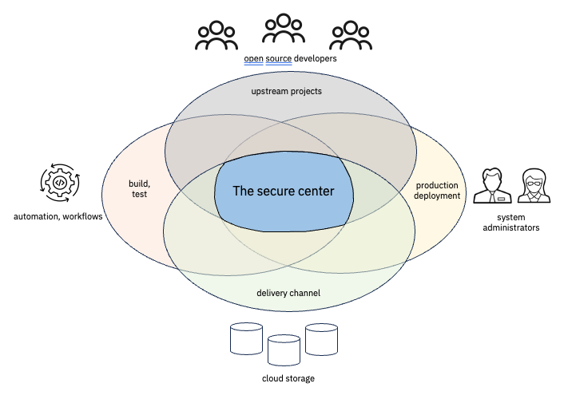

# Open Source Security from the Top
The security of an open source deployment depends on multiple components:
- The attack resistance of the original code base created by the upstream community
- The quality of the build and test process 
- The security characteristics of the delivery channel for the built content
- Management of the deployment in the production environment
----

  
_**figure 1.  The secure center**_

----
A threat actor may compromise any component of the secure environment to generate an attack.  By
securing all components of the ecosystem from upstream developer to production, we create the 
secure center that is much more resistant to attack.

Enterprise system planners and administrators only have control of this environment to the extent that 
they allow or prevent certain software packages at certain versions into their production 
environments.  However, by partnering with open source and commercial partners, enterprises can 
create a secure runtime for their production workloads.

The open source community is working with government agencies like [CISA](https://www.cisa.gov/) and
standards bodies like the Linux Foundations' [Open Source Security Foundation](https://openssf.org/) 
to define security standards for open source communities to follow, with the goal of providing planners 
and administrators the tools they need to make informed deployment decisions.  While a lot of progress 
has been made in this area, the amount of information to digest, or ingest into a decision support 
toolset can be overwhelming.  

IBM and other vendors have begun to act in the role of trusted open source provider to serve as an 
intermediary between open source communities and corporate enterprises to help manage some of the 
deployment decision making necessary to remain secure.  It's the goal of this project to provide 
software that has been vetted for known problems, scanned for potential weaknesses, and delivered 
through a controlled deployment channel.  We also outline some best practices that describe how best 
to leverage the open source in a way that makes sense in a z/OS environment.
